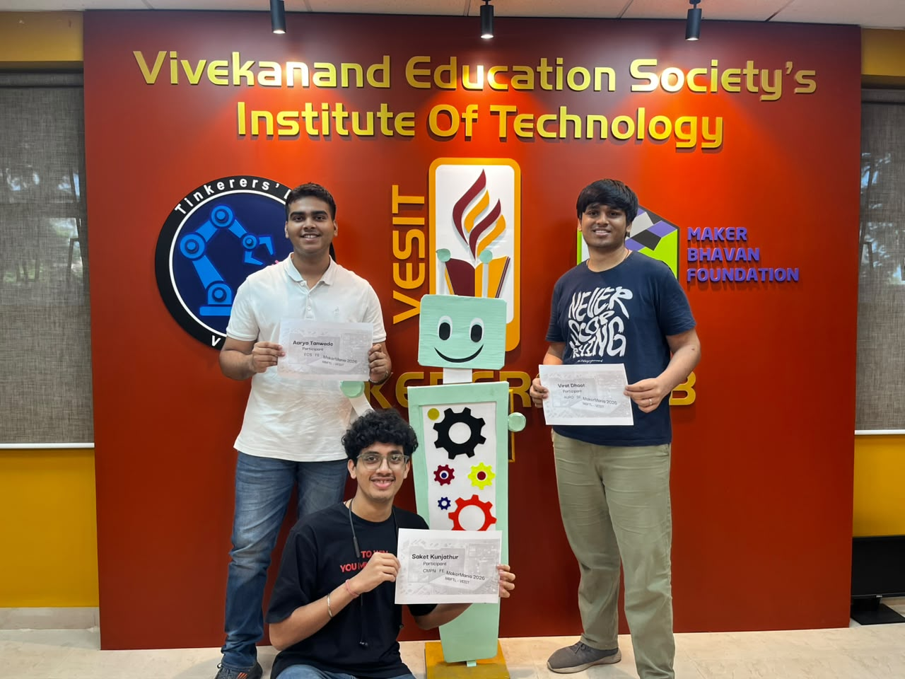

# Team Vega | MakerMania 2026

  

  
  
  
  
  
  
  
  

---

## Repository Overview

This repository documents **Team Vega’s MakerMania 2026 journey** at **MBF Tinkerers' Lab, VESIT**.

It is maintained as a working project notebook for training work, CAD/3D printing practice, laser cutting, problem discovery, user research, prototype development, testing, documentation, and final pitch preparation.

Our current main project direction is **Brawl Box Mini** — a compact, physical handheld multiplayer gaming console prototype prioritizing tactile hardware feedback and ESP-NOW local networking over standard screen-based gaming.

---

## Quick Links

| Section                                | Link                                                                                                           |
| -------------------------------------- | -------------------------------------------------------------------------------------------------------------- |
| Brawl Box Mini Project Specs           | [View Project Specs](docs/Project%20Specs%20-%20Brawl%20Box%20Mini/README.md)                                  |
| Live BOM / Component Tracker           | [View Notion BOM](https://groovy-target-365.notion.site/Brawl-Box-384fc8af23368001a3b7db0b6b2d9bc3?pvs=73)     |
| Week 1 Training Summary                | [Training Material README](Training%20Material/README.md)                                                      |
| BusyBuds Documentation                 | [Week 1 Useless Product README](Training%20Material/Week%201%20Useless%20Product/README.md)                    |
| BusyBuds Product Ad                    | [Watch on YouTube](https://youtu.be/96Pshy8Dwqc)                                                               |
| BusyBuds Bloopers / BTS                | [Watch on YouTube](https://youtu.be/p63lrrhlUBI)                                                               |
| Problem Discovery                      | [View Problem Discovery Section](#2-problem-discovery)                                                         |
| User Research Summary                  | [Problem Statement Response Summary](docs/User%20Research/Problem%20Statement%20Response%20Summary.md)         |
| SCAMPER Activity                       | [View PPT](Training%20Material/Week%202%20-%20SCAMPER%20Activity/SCAMPER%20Activity%20-%20Team%20Vega.pptx)    |
| ESP32 Revision Proof                   | [LED Series Blink Video](Training%20Material/Week%202%20-%20ESP32%20Revision/ESP32%20LED%20Series%20Blink.mp4) |

---

## BusyBuds Useless Product Activity

As part of the Week 1 useless product activity, we created **BusyBuds** — fake earbuds that do not play sound, but help you look busy.

| BusyBuds Product Ad                                                                                                         | BusyBuds Bloopers / BTS                                                                                                     |
| --------------------------------------------------------------------------------------------------------------------------- | --------------------------------------------------------------------------------------------------------------------------- |
|  |  |
| [Watch Product Ad](https://youtu.be/96Pshy8Dwqc)                                                                            | [Watch Bloopers / BTS](https://youtu.be/p63lrrhlUBI)                                                                        |

---

## Innovation Project Workbook

> Program Duration: 1 June 2026 – 4 July 2026  
> Location: MBF Tinkerers' Lab 007  
> Team Size: 3 Students  
> Goal: Identify a real-world problem and develop an innovative, patentable, and implementable solution.

---

## Repository Navigation

| Folder / File                                  | Purpose                                                                                   |
| ---------------------------------------------- | ----------------------------------------------------------------------------------------- |
| `README.md`                                    | Main project documentation and progress tracker                                           |
| `Instruction.md`                               | GitHub and documentation instructions shared by MBFTL                                     |
| `images/`                                      | Team photos, UI mockups, and common images used in documentation                          |
| `cad/`                                         | PCB CAD, KiCad files, block diagrams, and enclosure 3D models                             |
| `cad/KiCad Project - Brawl Box Mini V1 (MAIN)/`| Current KiCad schematic & single-layer PCB routing for the V1 MakerMania sprint           |
| `cad/KiCad Project - Brawl Box Emulator/`      | Advanced double-layer PCB architecture for the future V2 TFT roadmap                      |
| `code/`                                        | ESP32 code files, ESP-NOW test programs, and single-player game logic                     |
| `docs/Project Specs - Brawl Box Mini/`         | Brawl Box Mini (V1) project specifications, BOM, architecture, and planning               |
| `docs/User Research/`                          | Google Form response summary, anonymized data, and user research notes                    |
| `Training Material/Week 1 Useless Product/`    | BusyBuds STL files, printed product photo, thumbnail, and detailed documentation          |
| `Training Material/Week 2 - SCAMPER Activity/` | SCAMPER activity PPT and ideation notes                                                   |
| `Training Material/Week 2 - ESP32 Revision/`   | ESP32 revision proof video and basic hardware testing activity                            |

<b>📁 View Individual Training Folders</b>

| Folder                                         | Contents                                                                                  |
| ---------------------------------------------- | ----------------------------------------------------------------------------------------- |
| `Training Material/Aarya Tanwade/`             | CAD practice, laser cutting files, ID card design, keychain models, and 3D modelling work |
| `Training Material/Saket Kunjathur/`           | ID card files, keychain model, stuffing box CAD files, and 3D modelling work              |
| `Training Material/Virat Dhoot/`               | Virat’s training material folder                                                          |

---

## Progress Log

| Phase  | Activity                            | Output / Evidence                                                                                                        | Status         |
| ------ | ----------------------------------- | ------------------------------------------------------------------------------------------------------------------------ | -------------- |
| Week 1 | Startup Speed Dating                | Team interaction and activity-based introductions                                                                        | ✅ Completed    |
| Week 1 | Fusion 360 / CAD basics             | CAD practice and training files inside `Training Material/`                                                              | ✅ Completed    |
| Week 1 | Laser cutting basics                | MDF design / ID card style laser cutting activity                                                                        | ✅ Completed    |
| Week 1 | 3D printing basics                  | STL files and printed outputs created during training                                                                    | ✅ Completed    |
| Week 1 | Useless Product activity            | BusyBuds concept, 3D model, printed product, ad video, and bloopers                                                      | ✅ Completed    |
| Week 1 | Documentation setup                 | Main README, Training Material README, and BusyBuds README updated                                                       | ✅ Completed    |
| Week 2 | Google Form response review         | Reviewed problem statements collected through the Google Form and identified early problem themes                        | ✅ Completed    |
| Week 2 | Problem statement discussion        | Discussed Google Form ideas and team-generated ideas based on feasibility, hardware scope, and user pain                 | ✅ Completed    |
| Week 2 | SCAMPER activity                    | Explored ideas using the SCAMPER framework and selected a gig worker heat/safety device idea for the activity discussion | ✅ Completed    |
| Week 2 | ESP32 revision session              | Revised ESP32 basics through a simple LED series blink demonstration uploaded as proof of work                             | ✅ Completed    |
| Week 2 | Project direction discussion        | Explored multiple ideas and moved toward a handheld multiplayer device concept                                           | ✅ Completed    |
| Week 2 | Brawl Box component planning        | Prepared component list, power architecture, and device-level hardware plan                                              | ✅ Completed    |
| Week 2 | V1 Schematic / Block Diagram        | Initial KiCad and rough hardware architecture for V1 completed                                                           | ✅ Completed    |
| Week 3 | Multiplayer Logic (Maze Blaze)      | ESP-NOW Host/Client lobby setup and maze synchronization logic                                                           | 🔄 In progress |
| Week 3 | Single-Player / Menu Development    | Developing single-player fallback games and main device UI menu                                                          | 🔄 In progress |
| Week 3 | V1 PCB Routing & Optimization       | Single-layer bottom-routed layout in KiCad; optimizing tactile button placement                                          | 🔄 In progress |

---

# 1. Team Identity

## 1.1 Team Name and Photo

**Team Vega**

  

## 1.2 Team Members

| Name            | Branch | Year | Project Contribution                                                                                                                                           | Skills / Interests                                                                             |
| --------------- | ------ | ---- | -------------------------------------------------------------------------------------------------------------------------------------------------------------- | ---------------------------------------------------------------------------------------------- |
| Aarya Tanwade   | ECS    | FE   | Lead Hardware Architect; PCB Design (Schematic, Layout, Routing, & Manufacturing); Single-player game logic & UI menu; Project documentation; Video editing. | AI/ML, Python, Embedded Systems (ESP32, Raspberry Pi), KiCad, Product Thinking, Video Editing. |
| Virat Dhoot     | AURO   | SE   | 3D Enclosure Design, Ideation discussions, team activity participation, hardware assembly preparation.                                                                              | Python, automation/robotics interest, hardware prototyping                                     |
| Saket Kunjathur | CMPN   | FE   | Software Lead, Maze Blaze multiplayer game logic, ESP-NOW Host/Client lobby setup, PAM8403 breadboard testing.                                                                | Programming, CAD/Fusion 360 practice, KiCad basics, ESP32 Wi-Fi/ESP-NOW logic                  |
---

## 1.3 Week 1 Training Summary

Week 1 focused on learning the basic workflow of hardware prototyping.

### Activities Covered
* 🤝 Startup Speed Dating activity
* 🧩 Fusion 360 / CAD basics
* 🔥 Laser cutting basics
* 🖨️ 3D printing basics
* 🎧 Useless product activity
* 🎬 BusyBuds product ad and pitch
* 📝 GitHub documentation setup

Detailed Week 1 summary: [Training Material README](Training%20Material/README.md)

---

### Week 1 Highlight: BusyBuds
BusyBuds was our useless product activity output. It is a pair of fake solid earbuds that do not play audio, do not connect to Bluetooth, and do not require charging. The idea was to pitch it like a real product by framing it as a social signal for looking busy and avoiding interruptions.

* [BusyBuds Documentation](Training%20Material/Week%201%20Useless%20Product/README.md)
* [BusyBuds Product Ad](https://youtu.be/96Pshy8Dwqc)
* [BusyBuds Bloopers / BTS](https://youtu.be/p63lrrhlUBI)

---

## 1.4 Week 2 Update: Problem Discovery, SCAMPER & ESP32 Revision

Week 2 started with problem discussions, user research, ideation activities, and basic electronics revision.

### SCAMPER Activity Summary
During the SCAMPER activity, we discussed multiple ideas and tried to evaluate them from different angles. 
One idea discussed by Virat was a local-train bag holder for people who experience shoulder pain while carrying heavy bags. However, we dropped it because the load was mostly shifted rather than reduced. 
Another idea discussed was a low-cost safety device for delivery and gig workers. This idea was selected for the SCAMPER activity and used for ideation practice, but it was not finalized as the main project direction.

### ESP32 Revision
We also had a basic ESP32 revision session. A simple LED series blink activity was performed as proof of hardware testing.
Evidence: [ESP32 LED Series Blink Video](Training%20Material/Week%202%20-%20ESP32%20Revision/ESP32%20LED%20Series%20Blink.mp4)

---

# 2. Problem Discovery

## 2.1 Observation Area

Problem discovery started with real-life problem statements collected through Google Form responses, personal observations, informal discussions, team discussions, and mentor feedback.

**Current status:**
* Google Form responses were reviewed, and early ideas were discussed.
* Ideas that were too expensive, software-heavy, or difficult to prototype within a 30-day sprint were dropped.
* The current selected direction is **Brawl Box Mini**, focusing on **Maze Blaze**, a 2-player handheld multiplayer console.

---

## 2.2 AEIOU Observation Sheet

### Activities (What are users doing?)
* Users are being asked about repeated tasks, inconveniences, and situations where they face difficulty or boredom.
* For Brawl Box Mini, we are observing how students engage with casual games, physical controls, group play, and screen-free multiplayer activities (e.g., racing through a maze and throwing digital bombs via a rotary encoder).

### Environment (What conditions affect them?)
* For Brawl Box Mini, the intended environment is a casual indoor setting such as a classroom, lab, home, college space, or maker showcase table.

### Interactions (Who or what are they interacting with?)
* For Brawl Box Mini, users interact with a handheld console, 1.3" OLED display, tactile push buttons, rotary encoder, PAM8403 audio amplifier, vibration feedback, and dynamically with the other player via ESP-NOW.

### Objects (What tools or products are used?)
* Existing tools and workarounds were documented while evaluating problem statements.
* For Brawl Box Mini, objects include ESP32 WROOM boards, 1.3" OLED displays, rotary encoders, PAM8403 modules, 8Ω speakers, DC vibration motors, LiPo batteries, and 3D printed enclosures.

### Users (Who are the primary users?)
* For Brawl Box Mini, the primary users are students, children, casual players, and maker-event visitors who want to play short physical multiplayer games without needing smartphones.

---

## 2.3 Observation Log

| Observation                                                                                                            | Evidence                          | Pain Point / Note                                                |
| ---------------------------------------------------------------------------------------------------------------------- | --------------------------------- | ---------------------------------------------------------------- |
| Multiple problem statements were collected through a Google Form.                                                      | Google Form responses             | Used as input for early problem discovery                        |
| Some ideas came from user responses, while others came from team discussion and SCAMPER activity.                      | Form responses + team discussion  | Needed evaluation and filtering                                  |
| Public transport-related issues appeared in responses, including local train crowding, ventilation, and bus tracking.  | Form responses                    | Some issues are real but may need infrastructure-level solutions |
| Local-train commuters carrying heavy bags may face shoulder pain.                                                      | Team discussion                   | Idea dropped because load was shifted, not reduced               |
| Reminder, focus, and procrastination-related problems appeared in responses.                                           | Form responses                    | More software-heavy, not currently preferred for hardware sprint |
| A 2-player handheld multiplayer game device was discussed as a physical, screen-free, electronics-focused product.     | Team discussion + mentor feedback | Selected for V1 component planning and hardware design           |

---

# 3. User Research

## 3.1 Interview / Form Response Summary
Number of form responses reviewed: 10

Current status:
* User problem collection was started through a Google Form and informal discussions.
* Final shortlisting was based on user pain, frequency, feasibility, cost, hardware scope, and mentor discussion.
* Response summary: [Problem Statement Response Summary](docs/User%20Research/Problem%20Statement%20Response%20Summary.md)

---

## 3.2 Key Quotes
1. *In progress*
2. *In progress*
3. *In progress*

---

## 3.3 User Persona

**Name:** Casual student / young player
**Age:** 10–20 years
**Occupation:** Student / casual player

**Goals:**
* Play a quick and fun multiplayer game physically.
* Compete with friends without needing a phone.
* Experience a simple but interactive gaming device.

**Frustrations:**
* Many casual games are phone/app based.
* Board games can feel repetitive.
* DIY electronic games often look unfinished or lack physical feedback.

**Needs:**
* Simple rules and quick setup.
* Clear visual interface on an OLED screen.
* Tactile controls (D-Pad and Rotary dial).
* Fun physical feedback through PAM8403 audio and vibration motors.

---

# 4. Problem Framing

## Problem Statement

Students and young casual players need a fun, portable, screen-free physical multiplayer gaming experience because many casual multiplayer games are either phone-based, board-game based, or lack tactile electronic interaction.

**Current framing:**
**Brawl Box Mini** aims to create a compact handheld multiplayer console where each player gets a dedicated physical device featuring tactile controls, a rotary encoder, an OLED display, audio, vibration, and ESP-NOW wireless interaction.

---

## How Might We Questions

1. How might we create a physical multiplayer game experience that does not depend on smartphones?
2. How might we make a low-cost DIY handheld gaming device that feels polished and interactive?
3. How might we use physical controls (rotary encoder), sound (PAM8403), and vibration to make the game more engaging than a simple screen-only game?
4. How might we design the hardware so it can support multiple simple games via firmware in the future?

---

## Opportunity Ranking

| Criteria         | Score / Note                                                                                                                   |
| ---------------- | ------------------------------------------------------------------------------------------------------------------------------ |
| Severity         | Medium — entertainment/problem framing is lighter than safety problems, but the product has clear interaction value            |
| Frequency        | Medium — casual play can happen repeatedly in school/college/home/event settings                                               |
| Feasibility      | High — ESP32, OLED, buttons, audio, vibration, and enclosure are buildable within the sprint                                   |
| Novelty          | Medium to High — physical multiplayer handheld devices with rotary targeting and haptic feedback can make the project distinct |
| Market Potential | Medium — possible as a student activity/game kit or maker showcase product                                                     |
| Total            | *In progress*                                                                                                                  |

---